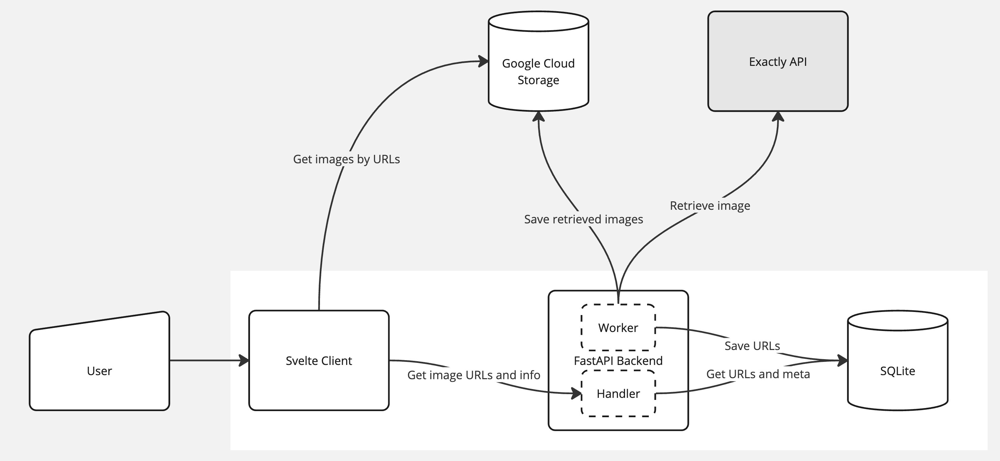

# CatDog🐾 Image Gallery

## Description

The CatDog🐾 Image Gallery is a web service that showcases a dynamic collection of cat and dog images. It consists of a SvelteKit frontend for displaying images and a FastAPI backend for image retrieval, classification, and storage. The service integrates with external APIs and Google Cloud Storage to manage and update its content dynamically.

## Local Development

For setting up and running the project locally, you will need to configure both the frontend and the backend. Each part has its own set of dependencies and environment variables.

- **Frontend**: For instructions on setting up and running the frontend, see the [frontend README file](./frontend/README.md).
- **Backend**: For backend setup and API details, refer to the [backend README file](./backend/README.md).

## Deployment

The frontend is served by the backend, simplifying the deployment process. All relevant deployment instructions, including environment setup and server configuration, are provided in the backend documentation.

- **Deployment Instructions**: For detailed deployment procedures, refer to the [backend README file](./backend/README.md).
- **Note**: the entire application is deployed using [CapRover](https://caprover.com/).

## Proposed Improvements

Several enhancements are recommended to increase the robustness and scalability of the service:

- **Decoupling Worker Tasks**: Move the asynchronous worker from the backend into a separate service, managed by a task queue such as Celery. This would improve manageability and scalability, allowing for more flexible worker scaling.
  
- **Scalability Enhancements**: To enable the backend to support multiple instances effectively, move the "last retrieved at" timestamp from a shared variable to an external storage solution like Redis or integrate it into the existing SQL database. This change would prevent race conditions and ensure consistency across instances.
  
- **Database Upgrade**: Replace the SQLite database with a more robust solution like PostgreSQL or Cloud SQL to enhance performance and scalability under heavier loads and to provide better support for concurrent transactions.

These improvements aim to optimize the service for larger scale deployments and enhance overall reliability and maintainability.
